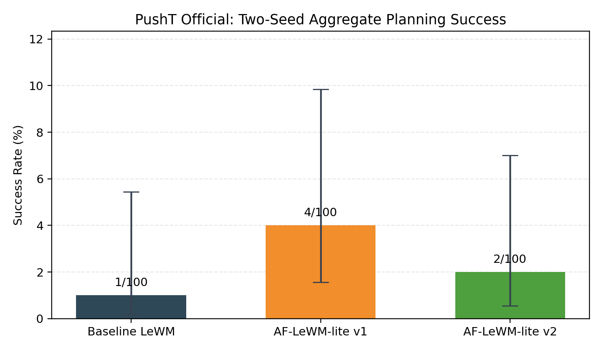
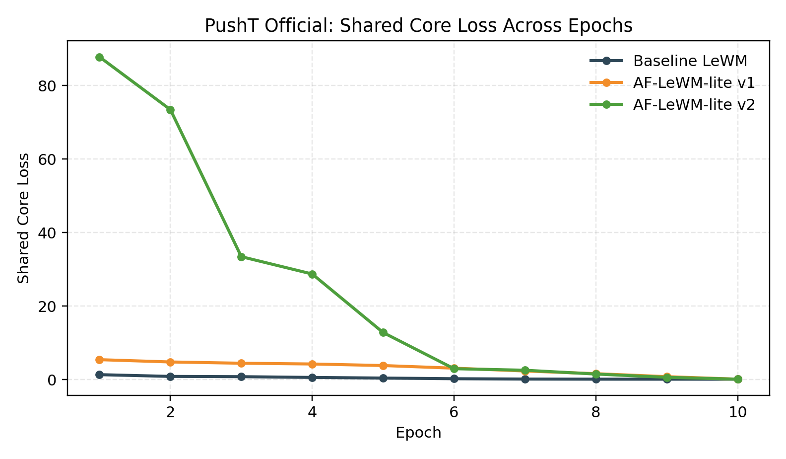

# AF-LeWM-lite Experiments

AF-LeWM-lite is a LeWorldModel-derived JEPA variant that splits the latent into dynamics and appearance branches, keeps planning on the dynamics branch, and studies whether appearance shaping improves PushT control under matched training budgets.

This repository packages the experiment code, PushT-only study configs, report assets, and reproducible utilities used to evaluate:

- Baseline LeWM
- AF-LeWM-lite v1
- AF-LeWM-lite v2

The implementation is based on the public [LeWorldModel](https://github.com/lucas-maes/le-wm) release and keeps the original training and planning pipeline from `stable-worldmodel`.

## Highlights

- Factorized latent extension of LeWM with a dedicated appearance branch.
- Two AF variants:
  - `v1`: latent split + appearance invariance + independence penalty
  - `v2`: `v1` plus sequence-consistent augmentations, stop-grad invariance, nuisance prediction, and a dynamics-side nuisance adversary
- Official PushT study configs with a matched 10-epoch budget.
- Corrected evaluation pipeline with real history reconstruction, goal-step alignment, result overwrite, and auxiliary BatchNorm freezing.
- Included report PDF, source TeX, figures, and result tables.

## Visual Summary

Two-seed aggregate PushT planning outcome across the corrected study:



Shared validation core loss across epochs for the main three models:



## Repository Layout

```text
.
|- train.py                         # Training entrypoint
|- eval.py                          # Planning / policy evaluation entrypoint
|- jepa.py                          # JEPA model with AF-LeWM-lite extensions
|- run_all.py                       # Reproduction helper for status/train/eval
|- validate_setup.py                # Local environment and dataset checks
|- config/train/                    # Baseline, AF v1, AF v2 configs
|- config/eval/                     # Evaluation configs
|- tools/                           # Dataset download and report utilities
`- report/                          # Final report, plots, CSV/JSON summaries
```

## Installation

Python 3.10 is the expected runtime.

### Option 1: `uv`

```bash
uv venv --python 3.10
uv pip install -r requirements.txt
```

### Option 2: `pip`

```bash
python -m venv .venv
source .venv/bin/activate
pip install -r requirements.txt
```

On Windows PowerShell, activate the environment with:

```powershell
.\.venv\Scripts\Activate.ps1
```

## Data Preparation

The final study in this repository uses the official PushT dataset at:

```text
$STABLEWM_HOME/pusht_expert_train.h5
```

`STABLEWM_HOME` defaults to `~/.stable-wm`. Set it explicitly if you store data elsewhere:

```bash
export STABLEWM_HOME=/path/to/cache
```

On Windows PowerShell:

```powershell
$env:STABLEWM_HOME = "D:\\stable-wm"
```

### Download the official PushT dataset

PowerShell helper:

```powershell
.\tools\download_official_datasets.ps1
```

Then extract any downloaded archives:

```bash
python extract_datasets.py
```

Verify the dataset and environment:

```bash
python validate_setup.py
```

## Usage

### Check status

```bash
python run_all.py --mode status --env pusht
```

### Train the baseline and AF variants

```bash
python train.py --config-name=lewm_pusht_official_budget output_model_name=lewm_pusht_implfix_budget
python train.py --config-name=aflewm_pusht_official_budget output_model_name=aflewm_pusht_implfix_budget_rerun
python train.py --config-name=aflewm_pusht_v2_official_budget output_model_name=aflewm_pusht_v2_implfix_budget_rerun
```

### Evaluate a checkpoint on PushT

Use checkpoint paths relative to `STABLEWM_HOME` and omit the `_object.ckpt` suffix:

```bash
python eval.py --config-name=pusht.yaml policy=runs/pusht_expert_train/lewm_pusht_implfix_budget/lewm_pusht_implfix_budget_epoch_10
python eval.py --config-name=pusht.yaml policy=runs/pusht_expert_train/aflewm_pusht_implfix_budget_rerun/aflewm_pusht_implfix_budget_rerun_epoch_10
python eval.py --config-name=pusht.yaml policy=runs/pusht_expert_train/aflewm_pusht_v2_implfix_budget_rerun/aflewm_pusht_v2_implfix_budget_rerun_epoch_10
```

Second evaluation seed:

```bash
python eval.py --config-name=pusht.yaml seed=43 policy=runs/pusht_expert_train/lewm_pusht_implfix_budget/lewm_pusht_implfix_budget_epoch_10 output.filename=pusht_results_seed43.txt
```

### Regenerate report assets

```bash
python tools/generate_pusht_official_report_assets.py
```

To rebuild the main PDF report:

```bash
xelatex -interaction=nonstopmode -halt-on-error -output-directory=report report/pusht_aflewm_official_summary.tex
xelatex -interaction=nonstopmode -halt-on-error -output-directory=report report/pusht_aflewm_official_summary.tex
```

## AF-LeWM-lite Design

### AF-LeWM-lite v1

- Split the learned latent into a planning latent `emb` and an appearance latent `app_emb`.
- Keep the predictor and planner attached only to `emb`.
- Add appearance-only augmentations and an invariance loss on `emb`.
- Add a cross-covariance independence penalty between `emb` and `app_emb`.

### AF-LeWM-lite v2

- Keep the `v1` factorized latent.
- Make appearance augmentations consistent across time within a sequence.
- Use stop-grad asymmetry for the appearance invariance loss.
- Train `app_emb` to predict nuisance parameters sampled from the augmentations.
- Add a gradient-reversal nuisance head on `emb` to reduce nuisance leakage into the planning branch.

## Results

### Primary matched-compute PushT study

10 epochs, 200 train batches per epoch, 20 validation batches per epoch, batch size 4, bf16, official PushT dataset, and two 50-episode evaluation seeds.

| Model | Params | Shared core loss | Seed 42 | Seed 43 | Aggregate |
| --- | ---: | ---: | ---: | ---: | ---: |
| Baseline LeWM | 18.03M | 0.14796 | 0/50 | 1/50 | 1/100 = 1.0% |
| AF-LeWM-lite v1 | 18.17M | 0.14963 | 2/50 | 2/50 | 4/100 = 4.0% |
| AF-LeWM-lite v2 | 18.24M | 0.15181 | 0/50 | 2/50 | 2/100 = 2.0% |

Shared core loss is `pred_loss + 0.09 * sigreg_loss`, which is the fairest loss comparison across baseline, `v1`, and `v2`.

### Current conclusion

- The corrected pipeline changes the earlier ranking. `v1` now has the best aggregate success rate, `v2` is second, and baseline is third.
- The effect size is small. The two-seed totals are `4/100` for `v1`, `2/100` for `v2`, and `1/100` for baseline.
- The confidence intervals overlap strongly, so the current result supports only a weak relative ordering.
- Baseline still has the best shared JEPA objective. Both AF variants trade predictive quality for a small and uncertain control gain.

See the full report for details:

- [Main PushT report](report/pusht_aflewm_official_summary.pdf)

## Notes

- The repository keeps the LeWM-compatible training and planning interface intact.
- Final conclusions in this repository are limited to official PushT experiments after the April 13, 2026 implementation fixes.
- The current study supports a small exploratory edge for `v1` and does not support a strong robustness claim for any AF variant yet.

## License

MIT. See [LICENSE](LICENSE).
