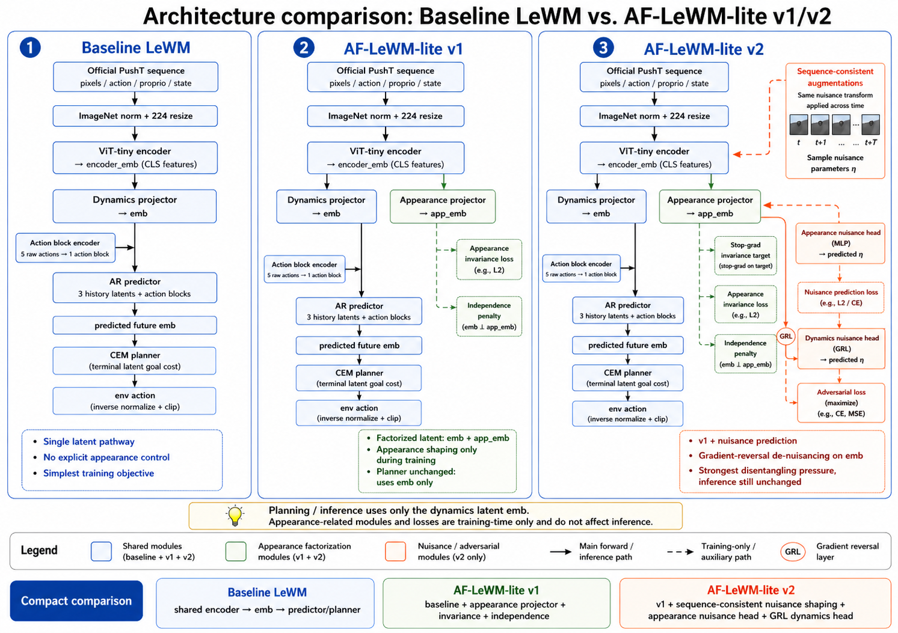
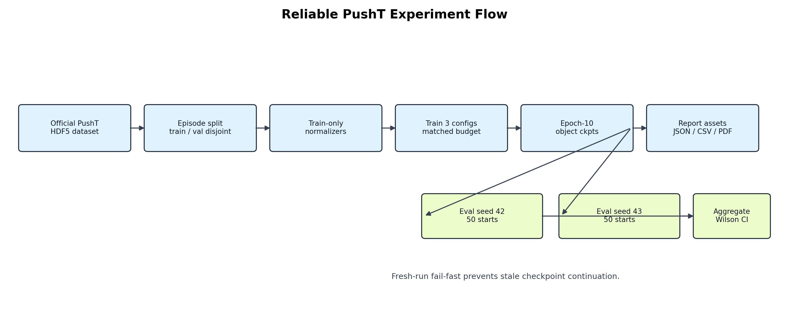
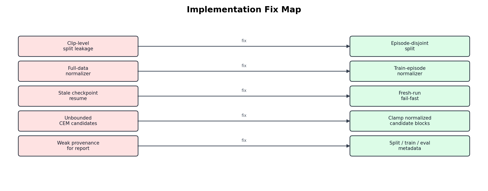

# Appearance-Factored LeWM-lite (AF-LeWM-lite) PushT Experiments

This repository is a compact, reliability-checked PushT study for Appearance-Factored LeWM-lite (AF-LeWM-lite), a LeWM-style JEPA world model with an appearance-shaping branch.

Here, `AF` means `Appearance-Factored`: the added branch factors appearance information into `app_emb` while planning still uses the dynamics latent `emb`. The action block encoder is inherited from baseline LeWM.

The repo now focuses on one experiment family:

- `Baseline LeWM`
- `Appearance-Factored LeWM-lite v1`: shared encoder, dynamics projection, appearance projection, invariance loss, independence penalty
- `Appearance-Factored LeWM-lite v2`: v1 plus sequence-consistent nuisance shaping and a dynamics-side gradient-reversal nuisance head

Planning uses only the dynamics latent. The appearance branch is a training-time shaping signal.

## Model Pipeline



The tracked PNG is the reviewed architecture comparison image. The old Mermaid
draft remains at `report/diagrams/aflewm_model_pipeline.mmd` for provenance.

## Reliable Experiment Flow



The diagram source is tracked at `report/diagrams/pusht_experiment_flow.mmd`.

## What Was Fixed



The reliable rerun is designed to avoid these experiment-validity failures:

- clip-level train/validation leakage from overlapping HDF5 windows
- full-dataset normalization leakage
- accidental continuation from stale checkpoints
- CEM planning over normalized actions outside valid environment bounds
- weak provenance for sampled evaluation rows and report inputs

## Repository Layout

```text
.
|- train.py                         # PushT training entrypoint
|- eval.py                          # PushT CEM planning evaluation
|- jepa.py                          # JEPA model with AF-LeWM-lite heads
|- module.py                        # Predictor, MLP, SIGReg helpers
|- run_all.py                       # PushT status/train/eval helper
|- validate_setup.py                # Environment, dataset, checkpoint validation
|- config/train/                    # Three matched PushT training configs
|- config/eval/                     # PushT evaluation config and CEM solver config
|- tools/                           # Dataset download and report generation
`- report/                          # PDF, TeX, diagrams, plots, CSV/JSON summary
```

## Installation

Python 3.10 is the expected runtime.

```bash
python -m venv .venv
source .venv/bin/activate
pip install -r requirements.txt
```

On Windows PowerShell:

```powershell
.\.venv\Scripts\Activate.ps1
pip install -r requirements.txt
```

## Data

The study uses the official PushT dataset:

```text
$STABLEWM_HOME/pusht_expert_train.h5
```

`STABLEWM_HOME` defaults to `~/.stable-wm`.

Download and extract:

```powershell
.\tools\download_official_datasets.ps1
python extract_datasets.py
```

Validate the local setup:

```bash
python validate_setup.py
python run_all.py --mode status --env pusht
```

## Run

Train all three matched PushT models:

```bash
python run_all.py --mode train --env pusht
```

Evaluate each epoch-10 checkpoint on two 50-start seeds:

```bash
python run_all.py --mode eval --env pusht
```

The reliable run names are:

```text
lewm_pusht_reliable
aflewm_pusht_v1_reliable
aflewm_pusht_v2_reliable
```

## Current Ablation Result

The full result is stage-dependent. Stage 1 was a short structural screen, where
`v1_current` and `v2_app_nuisance_only` were above baseline. Stage 2 was the
larger reliability check, where the scaled AF variants finished below baseline
at both inspected checkpoints.

### Stage 1 Structural Screen

Stage 1 used one training seed, eval seeds `42` and `43`, and `100` total
episodes per structure.

| Variant | Family | Seed 42 | Seed 43 | Aggregate | Delta vs baseline |
| --- | --- | ---: | ---: | ---: | ---: |
| `baseline` | LeWM | 4.0 | 8.0 | 6/100 = 6.0% | 0.0 pp |
| `v1_current` | v1 | 10.0 | 10.0 | 10/100 = 10.0% | +4.0 pp |
| `v1_inv_only` | v1 | 2.0 | 2.0 | 2/100 = 2.0% | -4.0 pp |
| `v1_indep_only` | v1 | 2.0 | 8.0 | 5/100 = 5.0% | -1.0 pp |
| `v1_seq_only` | v1 | 4.0 | 6.0 | 5/100 = 5.0% | -1.0 pp |
| `v1_seq_stopgrad` | v1 | 2.0 | 4.0 | 3/100 = 3.0% | -3.0 pp |
| `v2_app_nuisance_only` | v2 | 6.0 | 10.0 | 8/100 = 8.0% | +2.0 pp |
| `v2_weak_grl` | v2 | 2.0 | 10.0 | 6/100 = 6.0% | 0.0 pp |
| `v2_current` | v2 | 2.0 | 8.0 | 5/100 = 5.0% | -1.0 pp |
| `v2_grl_warmup` | v2 | 8.0 | 4.0 | 6/100 = 6.0% | 0.0 pp |

### Stage 2 Reliability Check

Stage 2 scaled the selected candidates: `baseline`, `v1_current`, and
`v2_app_nuisance_only`. It used two training seeds, eval seeds `42` through
`45`, and `400` total episodes per variant per checkpoint epoch.

| Checkpoint | Variant | Train seeds | Successes | Episodes | Success rate | Delta vs baseline |
| --- | --- | --- | ---: | ---: | ---: | ---: |
| epoch 25 | `baseline` | 3072, 3073 | 21 | 400 | 5.25% | 0.00 pp |
| epoch 25 | `v1_current` | 3072, 3073 | 19 | 400 | 4.75% | -0.50 pp |
| epoch 25 | `v2_app_nuisance_only` | 3072, 3073 | 20 | 400 | 5.00% | -0.25 pp |
| epoch 50 | `baseline` | 3072, 3073 | 25 | 400 | 6.25% | 0.00 pp |
| epoch 50 | `v1_current` | 3072, 3073 | 22 | 400 | 5.50% | -0.75 pp |
| epoch 50 | `v2_app_nuisance_only` | 3072, 3073 | 20 | 400 | 5.00% | -1.25 pp |

Decision: baseline is the main reliable PushT result for this repo. `v1_current`
remains a useful negative result because it produces cleaner latent
factorization diagnostics, but the current AF objectives do not improve PushT
planning success under this protocol.

## Report

Regenerate JSON, CSV, plots, diagrams, and the LaTeX source:

```bash
python tools/generate_pusht_official_report_assets.py
```

Build the PDF:

```bash
xelatex -interaction=nonstopmode -halt-on-error -output-directory=report report/pusht_aflewm_official_summary.tex
xelatex -interaction=nonstopmode -halt-on-error -output-directory=report report/pusht_aflewm_official_summary.tex
```

Primary report artifacts:

- `report/pusht_aflewm_official_summary.pdf`
- `report/pusht_aflewm_official_summary.tex`
- `report/pusht_official_budget_results.json`
- `report/pusht_official_budget_summary.csv`
- `report/pusht_success_rate.png`
- `report/pusht_val_core_loss.png`

## License

MIT. See `LICENSE`.
